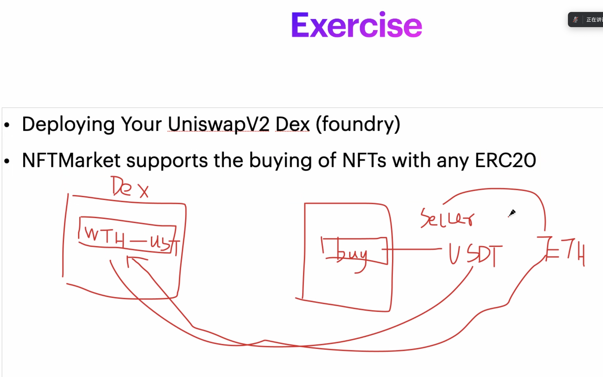

# 练习题（02.26）



## 1. 部署 UniswapV2 系列合约

- **UniswapV2Factory**：https://sepolia.etherscan.io/address/0xB771Da2e98A021ADd280064DE42B1fa134ED9327
- **WETH9**：https://sepolia.etherscan.io/address/0x550036343c294aa578a158c98b7a37d3d6a80bf8
- **UniswapV2Router02**：https://sepolia.etherscan.io/address/0x0c247e6292128f61486c4a64937afc54cd092db5#code

## 2. 修改 NFTMarket 使其能够支持使用任意 ERC20 token 购买 NFT

**功能设计**：在用户购买 NFT 时，用户可输入购买 NFT 所使用的 token 的地址`_ERC20TokenAddr`，并指定滑点（`_slippageLiteral`为滑点的数字部分，`_slippageDecimal`为小数点之后的位数）

### NFTMarket 相关功能代码：

#### A. {buy}：使用任意 token（考虑代币兑换的滑点）购买 NFT

```solidity
/**
 * @dev 使用任意 ERC-20 代币购买任意 NFT 地址的任意单个 NFT ，并考虑 ERC-20 代币 兑换为结算币种（WETH）的滑点。
 *
 * @param _ERC20TokenAddr 用户指定的 ERC-20 代币的合约地址
 * @param _nftAddr NFT 合约地址
 * @param _tokenId NFT 的 tokenId
 * @param _slippageLiteral 滑点的数字部分，例如 0.25% 的数字部分为 25 
 * @param _slippageDecimal 滑点的小数点之后的位数，例如 0.03% 的小数点之后的位数为 2
 */
function buy(address _ERC20TokenAddr, address _nftAddr, uint256 _tokenId, uint256 _slippageLiteral, uint256 _slippageDecimal) external {
				// 前置检查
        bool checkResult = _beforeNFTPurchase(msg.sender, _ERC20TokenAddr, _nftAddr, _tokenId);
				// 检查： 购买 NFT 是否需要验证签名，若存在对应的验证接口，则不可绕过验签来购买 NFT
        bool isERC721PermitSupported = _support_IERC721Permit(_nftAddr);
        if (isERC721PermitSupported) {
            revert ERC721PermitBoughtByWrongFunction("buy", "buyWithPermit");
        }
        // 若以上检查通过，则执行购买 NFT 的内部方法 {_handleNFTPurchaseWithSlippage}
        if (checkResult) {
        // {_handleNFTPurchaseWithSlippage} 方法：考虑滑点的代币兑换，并使用 WETH 购买 NFT
            uint256 tokenAmountPaid = _handleNFTPurchaseWithSlippage(msg.sender, _ERC20TokenAddr, _nftAddr, _tokenId, _slippageLiteral, _slippageDecimal);
            emit NFTBought(msg.sender, _ERC20TokenAddr, _nftAddr, _tokenId, tokenAmountPaid);
        }
    }
```


#### B. {_beforeNFTPurchase}：前置检查 NFT 上架状态、token 是否满足 ERC20、买家是否为该 NFT 持有者

```solidity
function _beforeNFTPurchase(address _buyer, address _ERC20TokenAddr, address _nftAddr, uint256 _tokenId)
        internal
        view
        returns (bool)
    {   
        // 检查：NFT 售价是否为 0，若为 0 则表示未上架状态
        if (price[_nftAddr][_tokenId] == 0) {
            revert notOnSale(_nftAddr, _tokenId);
        }

				// 检查：用户给定的 token 地址对应的合约是否满足 ERC20
        bool isIERC20Supported = _support_IERC20(_ERC20TokenAddr);
        if (!isIERC20Supported) {
            revert notERC20Token(_ERC20TokenAddr);
        }

        // 由于本 NFTMarket 合约的上架功能是通过转移原持有者的 NFT 到本合约中，然后反向 approve 给原持有者来实现的
        // 此处需要判定购买者是否为被授权者（即上架后反向授权的地址），若判断出购买者为原持有者，则回滚
        address previousOwner = IERC721(_nftAddr).getApproved(_tokenId);
        if (_buyer == previousOwner) {
            revert ownerBuyNFTOfSelf(_nftAddr, _tokenId, _buyer);
        }

        // 若上述检查全部完成且通过，则返回 true
        return true;
    }
```


#### C. {_handleNFTPurchaseWithSlippage}：考虑滑点的代币兑换，并使用 WETH 购买 NFT

```solidity
function _handleNFTPurchaseWithSlippage(address _nftBuyer, address _ERC20TokenAddr, address _nftAddr, uint256 _tokenId, uint256 _slippageLiteral, uint256 _slippageDecimal) internal returns (uint256 result) {
        uint256 NFTPrice = getNFTPrice(_nftAddr, _tokenId);
    		
    		// 判断用户用于购买 NFT 的 token 是否为 WETH
        if (_ERC20TokenAddr != wrappedETHAddr) {
        		// token 非 WETH，则需要兑换成 WETH
        		// {_estimateAmountInWithSlipage} 方法：获取考虑滑点的用于兑换的 token 数量
            uint256 amountInRequired = _estimateAmountInWithSlipage(_ERC20TokenAddr, NFTPrice, _slippageLiteral, _slippageDecimal);
            bool _success = IERC20(_ERC20TokenAddr).transferFrom(_nftBuyer, address(this), amountInRequired);
            require(_success, "ERC-20 token transferFrom failed");
            
            // 执行 token swap
            uint256 tokenBalanceBeforeSwap = IERC20(_ERC20TokenAddr).balanceOf(address(this));
            uint256 tokenAmountPaid = _swapTokenForExactWETH(_ERC20TokenAddr, NFTPrice, amountInRequired);
            uint256 tokenBalanceAfterSwap = IERC20(_ERC20TokenAddr).balanceOf(address(this));
            
            // 检查兑换所需要的 token 是否与本合约的 token 余额变化相等
            if (tokenBalanceAfterSwap >= tokenBalanceBeforeSwap || tokenBalanceBeforeSwap - tokenBalanceAfterSwap != tokenAmountPaid) {
                address[] memory _path = [_ERC20TokenAddr, wrappedETHAddr];
                revert tokenSwapFailed(_path, NFTPrice, amountInRequired);
            }
            // 令本方法的返回值为实际兑换所需要的 token 数量
            result = tokenAmountPaid;
        } else {
            bool _ok = IWETH9(wrappedETHAddr).transferFrom(_nftBuyer, address(this), NFTPrice);
            require(_ok, "WETH transferFrom failed");
            // 令本方法的返回值为 NFTPrice 价格本身
            result = NFTPrice;
        }
				
				// 执行 NFT 的转移
        IERC721(_nftAddr).transferFrom(address(this), _nftBuyer, _tokenId);
        
        // 增加卖家的余额（即收入，可以在本合约的另一个方法 {withdrawBalanceByUser} 中提款）
        userProfit[IERC721(_nftAddr).getApproved(_tokenId)] += NFTPrice;

        // 重置该 NFT 售价（即售价为 0 ，表示未上架）
        delete price[_nftAddr][_tokenId];
    }
```


#### D. {_estimateAmountInWithSlipage}：获取考虑滑点的用于兑换的 token 数量

```solidity
function _estimateAmountInWithSlipage(address _ERC20TokenAddr, uint256 _amountOut, uint256 _slippageLiteral, uint256 _slippageDecimal) internal returns (uint256) {
        address[] memory _path = [_ERC20TokenAddr, wrappedETHAddr];
        // 检查：滑点是否不为 0
        if (_slippageLiteral == 0 ||  _slippageDecimal == 0) {
            revert invalidSlippage(_slippageLiteral, _slippageDecimal);
        }
        // 获得不考虑滑点的兑换所需要付出的 token 数量
        uint256 amountInWithoutSlippage = getAmountsIn(_amountOut, _path)[0];
        // 获取考虑滑点的兑换所需要付出的 token 数量
        uint256 amountInWithSlippage = amountInWithoutSlippage * (10 ** _slippageDecimal +  _slippageLiteral) / (10 ** _slippageDecimal);
        return amountInWithSlippage;
    }
```

